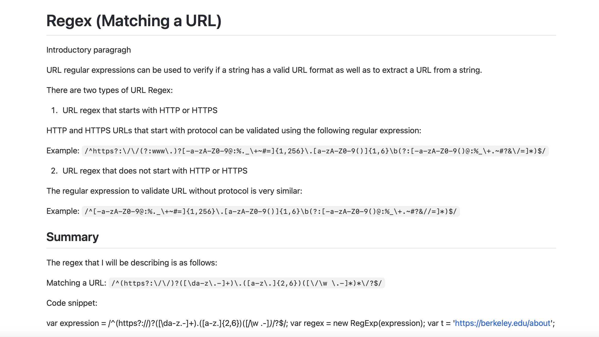
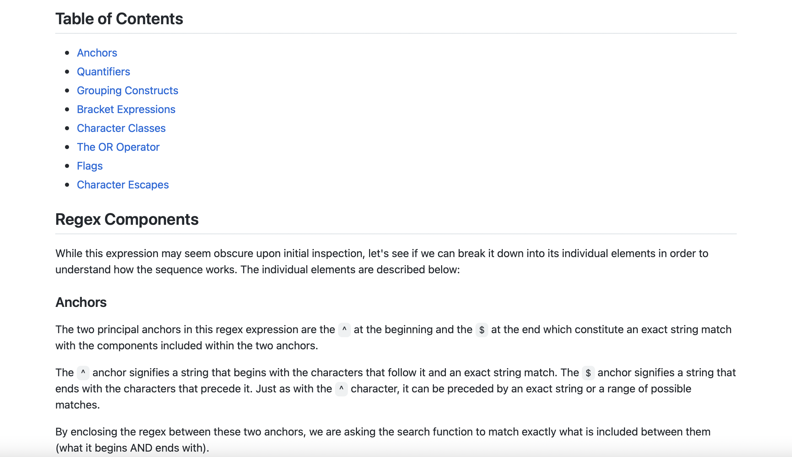
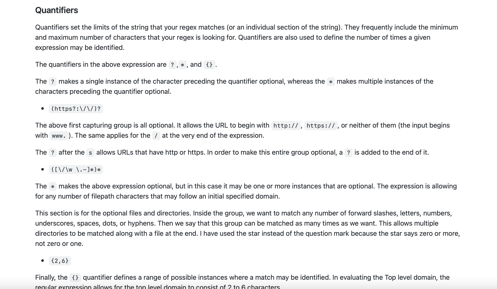
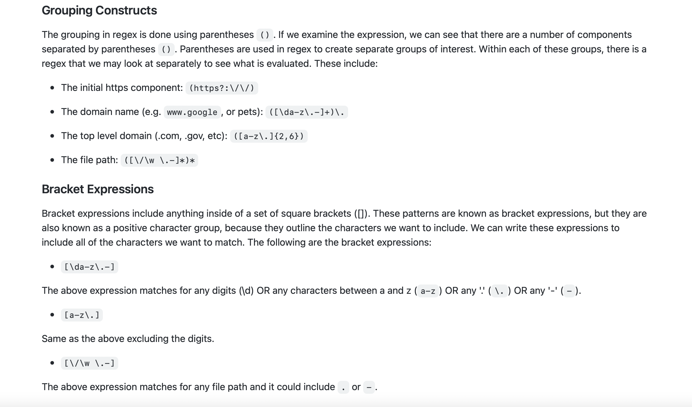
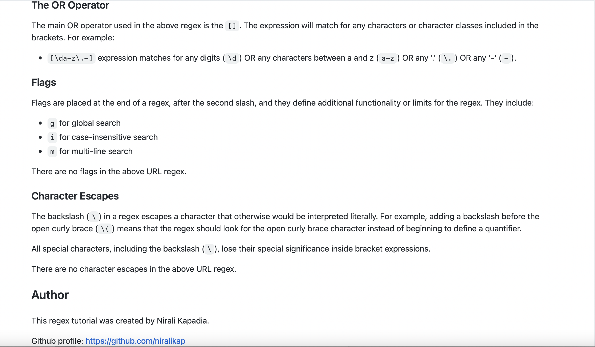

# 17 Computer Science for JavaScript: Regex Tutorial

## User Story

```md
AS A web development student
I WANT a tutorial explaining a specific regex
SO THAT I can understand the search pattern the regex defines
```

## Description

In this assignment, I have created a tutorial that explains how a specific regular expression, or regex, functions by breaking down each part of the expression and describing what it does. The regex that I have researched on is matching a URL.

It does the following:

- In the URL regex tutorial, when I open the tutorial, then I see a descriptive title and introductory paragraph explaining the purpose of the tutorial, a summary describing the regex featured in the tutorial, a table of contents linking to different sections that break down each component of the regex and explain what it does, and a section about the author with a link to the author’s GitHub profile.

- When I click on the links in the table of contents, then I am taken to the corresponding sections of the tutorial.

- When I read through each section of the tutorial, then I find a detailed explanation of what a specific component of the regex does.

- When I reach the end of the tutorial, then I find a section about the author and a link to the author’s GitHub profile.

Screenshots:





